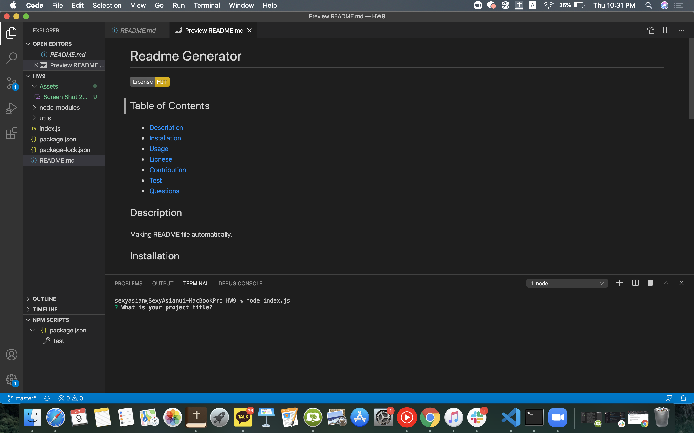
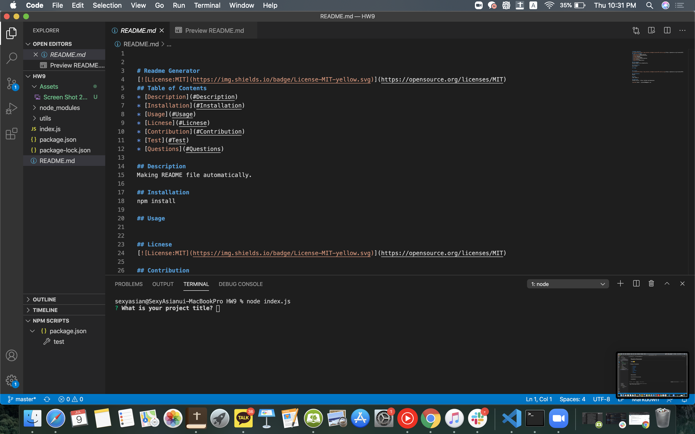
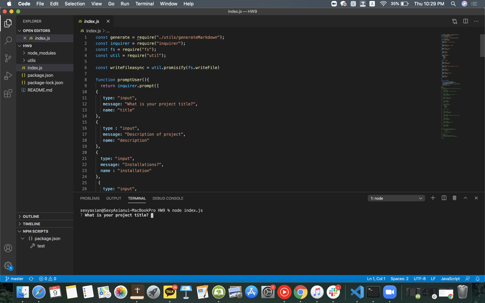

# Readme Generator

## Table of Contents
* [Description](#Description)
* [Installation](#Installation)
* [Usage](#Usage)
* [Licnese](#Licnese)
* [Contribution](#Contribution)
* [Test](#Test)
* [Questions](#Questions)

## Description
Making README file automatically.

## Installation
npm install 

## Usage

Here is a link for Demo of this program.
https://www.youtube.com/watch?v=J1VjMDAqATU&t=3s
## Licnese 

## Contribution
Nakwon Yoon

## Test
As you can see a terminal on the bottom of the image, we can just type "node index.js" to run this program.

## Questions 
Github profile : https://github.com/nakwonyoon

[Anytime] Email : yooonnw1000@gmail.com
